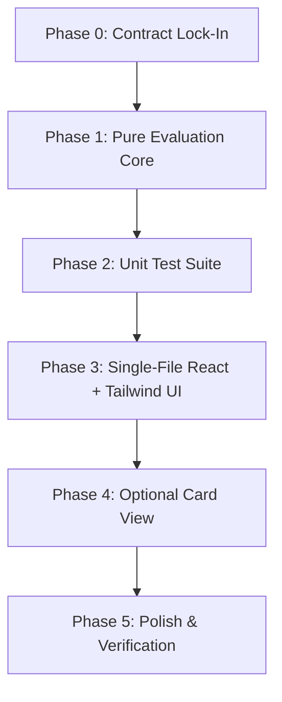

# AGENTS.md — Career Fair Eligibility Shortlist (`RoleFit`)

This document defines repository guidelines, operational rules, role responsibilities, and execution workflows for all AI agents working on this project.

---

## 1. Project Overview & Architecture

- **Project:** SI26_P06 — Career Fair Eligibility Shortlist (`RoleFit`)
- **Core Stack:** Single-file React with Tailwind CSS, client-side only, no backend.
- **Architectural Principle:** Pure-Function Core with a Thin UI Layer.
  - **Core Logic:** Pure, framework-agnostic TypeScript/JavaScript functions containing profile validation, role evaluation, skill normalization, deterministic sorting, and counter aggregation. Completely testable without DOM or React dependencies.
  - **UI Layer:** Single-file React presentation component binding inputs, rendering role requirements, displaying results with status badges, and managing user interactions (Evaluate, Sample, Reset).

---

## 2. Mandatory Agent Directives

### Bloat-Free Execution via `/ponytail`
All agents working on this project must strictly adhere to the `/ponytail` minimalist, bloat-free software engineering methodology:
- **Climb the Ponytail Ladder before writing code:**
  1. Does this need to be built at all? (YAGNI)
  2. Does it already exist in this codebase? Reuse existing functions, do not recreate.
  3. Does the standard library/native platform provide it? Use standard JS/TS methods (e.g., `Array.prototype.filter`, `Set`, `Intl`, `URLSearchParams`).
  4. Does an installed dependency already solve it? Avoid pulling in extra packages (e.g., do not install `lodash`, `ramda`, or complex form libraries for simple state).
  5. Keep diffs small, readable, and directly scoped to the task.
- **No Unsolicited Abstractions:** Do not create speculative wrappers, factory functions, or configuration layers for one-off operations.
- **Intentional Simplifications:** When pragmatic shortcuts are taken, document them with a `// ponytail: <rationale>` comment indicating any ceiling or future migration path.
- **Deletions over Additions:** Prioritize simplicity, readability, and deleting dead code over adding layers.

### Up-to-Date Technical Documentation via `/find-docs`
Never rely on training data assumptions or potentially obsolete syntax when working with libraries, frameworks, or tooling (React, Tailwind CSS, Vite, Vitest/Jest, etc.).
- **Always invoke `/find-docs` / Context7 CLI to verify APIs:**
  ```bash
  npx ctx7@latest library <name> "<query>"
  npx ctx7@latest docs <libraryId> "<query>"
  ```
- Verify exact Tailwind class utilities, configuration keys, and React API signatures prior to implementation.

---

## 3. Subagent Team Structure & Delegation

The project is orchestrated under a Tech Lead persona delegating tasks across specialized subagents:

| Agent Role | Subagent Name | Responsibilities |
|---|---|---|
| **Tech Lead** | (Primary) | Clarifies constraints, scopes tasks, coordinates subagent handoffs, and ensures overall alignment with `ROADMAP.md`. |
| **Architectural Planner** | `architechtural-planner` | Defines data contracts, boundary rules, static reference tables, edge-case matrices, and implementation checklists before coding begins. |
| **Codebase Search** | `codebase-search` | Performs fast contextual discovery across files, locating schemas, tests, and configuration patterns. |
| **Backend / Domain Dev** | `backend-dev` | Implements the pure evaluation core: `validateProfile`, `evaluateRole`, `evaluateAll`, `getCounts`, normalizers, and automated unit test suites. |
| **Coder** | `coder` | Implements frontend components, React state, Tailwind UI layouts, and connects the pure evaluation core into the single-file view. |
| **Reviewer** | `reviewer` | Audits code changes against acceptance criteria, checks for regressions, ensures zero bloat, verifies edge cases, and issues merge verdicts. |

---

## 4. Phased Roadmap Alignment

Agents must implement tasks following the phased structure defined in `ROADMAP.md`:



### Phase Summary:
1. **Phase 0 — Problem Framing & Contract Lock-In:**
   - Define immutable static data structures for the 5 fixed roles.
   - Establish assumptions: Sample and Reset load the built-in profile and auto-evaluate.
   - Lock in acceptance test cases (built-in profile, 8.5 CGPA boundary, CF05 failure order, invalid CGPA).
2. **Phase 1 — Pure Evaluation Core (DOM-free):**
   - Implement `validateProfile(profile)` returning standard validation errors (`INVALID_BRANCH`, `INVALID_CGPA`, `INVALID_GRADUATION_YEAR`, `INVALID_BACKLOG_COUNT`).
   - Implement `skill` normalization (trim, split by comma, filter empty, case-insensitive deduplication).
   - Implement `evaluateRole(profile, role)` evaluating all 5 rule criteria independently without short-circuiting.
   - Collect failure reasons in exact required order:
     1. `BRANCH_NOT_ALLOWED`
     2. `CGPA_BELOW_MINIMUM`
     3. `GRADUATION_YEAR_NOT_ALLOWED`
     4. `TOO_MANY_ACTIVE_BACKLOGS`
     5. `MISSING_SKILL: <skill>` (alphabetical, case-insensitive)
   - Implement `evaluateAll(profile, roles)`: Sort ELIGIBLE roles first, then INELIGIBLE roles; within each group sort alphabetically by title (case-insensitive), then by role ID ascending.
   - Implement `getCounts(results)` returning `{ eligible: number, ineligible: number }`.
3. **Phase 2 — Acceptance Unit Tests:**
   - Execute tests verifying the built-in profile (CF01, CF02 eligible; CF03, CF04, CF05 ineligible; counts 2/3).
   - Validate CGPA boundary switch at 8.5 (CF04 flips to eligible; counts 3/2).
   - Validate reason ordering and error banner behavior on invalid inputs.
4. **Phase 3 — UI Layer (Single-File React + Tailwind):**
   - Editable profile form (left/top) + fixed role requirements table + results panel (right/bottom).
   - Action buttons: Evaluate (runs validation then evaluation), Sample (loads profile and runs evaluation), Reset (restores baseline).
   - Crisp badges for eligible/ineligible states and red banners for validation failures.
5. **Phase 4 & 5 — Enhancements, Polish & Live Readiness:**
   - Optional compact card view toggle.
   - Prepare clean test run evidence and verify live-modification agility.

---

## 5. Coding & Quality Standards

- **Single Source of Truth:** Fixed role requirements must be defined in an immutable constant table.
- **Deterministic Ordering:** Always enforce primary sort by eligibility, secondary sort by Title (case-insensitive A-Z), tertiary sort by Role ID ascending.
- **Edge-Case Rigor:**
  - Skill comparison must always trim and ignore case (e.g. `" python "` == `"Python"`).
  - Number validation must enforce inclusive ranges: CGPA in `[0.0, 10.0]`, Graduation Year in `[2000, 2100]`, Backlogs `>= 0` as whole integers.
- **Clean Diffs:** Do not bundle formatting refactors with functional changes. Write readable, minimal code that meets the exact requirements without surplus complexity.
