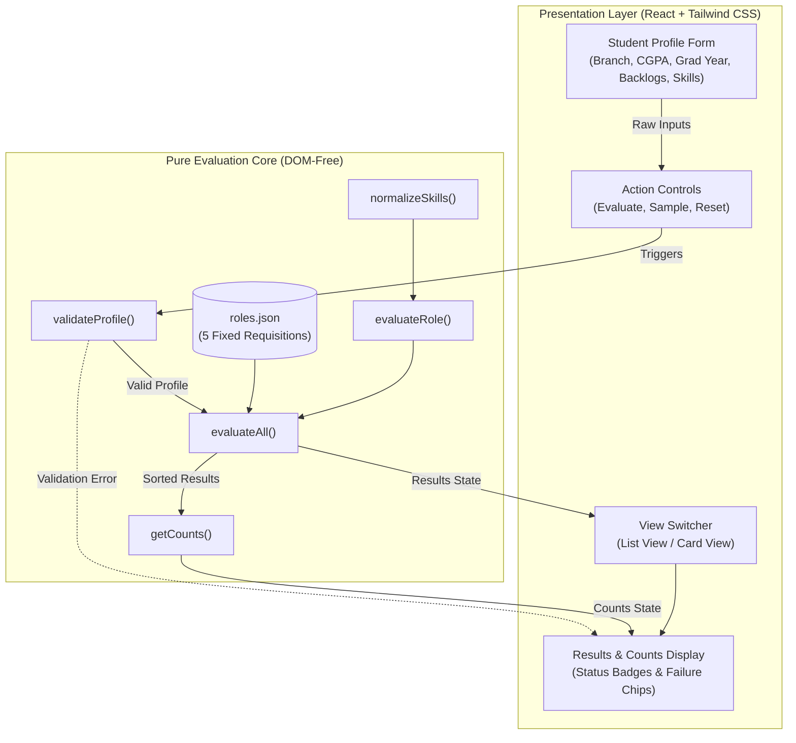

# RoleFit — Career Fair Eligibility Shortlist (`SI26_P06`)

`RoleFit` is a client-side eligibility screening engine and dashboard that evaluates candidate profiles against 5 fixed career fair requisitions. Built with a pure-function TypeScript core and a thin single-file React presentation component styled with Tailwind CSS, it provides deterministic, multi-criteria evaluation with zero backend dependencies.

---

## 1. System Architecture

The application follows the **Pure-Function Core with Thin UI** architectural pattern:
- **Pure Evaluation Core (`src/core/evaluator.ts`):** Framework-agnostic, DOM-free TypeScript functions containing all profile validation, skill normalization, multi-rule evaluation, and deterministic sorting logic. 100% testable via Node's native test runner without DOM mocking.
- **Thin Presentation Layer (`src/App.tsx`):** A single-file React component that captures user input, binds to the evaluation core, and displays results in either a detailed list view or a compact card grid.
- **Single Source of Truth (`roles.json`):** Role requisitions are defined as an immutable JSON constant imported by both the evaluator and the UI reference panel.



---

## 2. Fixed Career Fair Requisitions

The engine evaluates candidates against 5 immutable role requisitions defined in [`roles.json`](./roles.json):

| Role ID | Role Title | Allowed Branches | Min CGPA | Allowed Years | Max Backlogs | Required Skills |
|---|---|---|---|---|---|---|
| **CF01** | Data Operations Intern | CSE, IT | 7.5 | 2027 | 1 | Python, SQL |
| **CF02** | QA Automation Intern | CSE, ECE, IT | 7.0 | 2027, 2028 | 1 | Git |
| **CF03** | Embedded Systems Intern | ECE, EEE | 7.5 | 2027 | 1 | Git |
| **CF04** | Machine Learning Intern | CSE, IT | 8.5 | 2027 | 1 | Python |
| **CF05** | Platform Engineering Intern | CSE, ECE | 7.0 | 2026 | 0 | Docker, Git |

---

## 3. Evaluation Rules & Logic

### Input Validation
Profile inputs are validated in strict contractual order before evaluation begins:
1. **Branch:** Must be a non-empty string after trimming (`INVALID_BRANCH`).
2. **CGPA:** Must be a finite number within `[0.0, 10.0]` (`INVALID_CGPA`).
3. **Graduation Year:** Must be a whole integer within `[2000, 2100]` (`INVALID_GRADUATION_YEAR`).
4. **Active Backlogs:** Must be a whole non-negative integer `>= 0` (`INVALID_BACKLOG_COUNT`).

If validation fails, the UI displays a red alert banner with the error code and clears all evaluation results and summary counters.

### Multi-Rule Role Evaluation
All 5 criteria are evaluated independently for every role without short-circuiting. Unmet criteria are collected in exact deterministic order:
1. `BRANCH_NOT_ALLOWED`
2. `CGPA_BELOW_MINIMUM`
3. `GRADUATION_YEAR_NOT_ALLOWED`
4. `TOO_MANY_ACTIVE_BACKLOGS`
5. `MISSING_SKILL: <Skill>` (alphabetically sorted, case-insensitive)

### Skill Normalization
- Comma-delimited skill strings are split, trimmed, and deduplicated case-insensitively.
- Missing required skills are matched case-insensitively (e.g., `"python"` satisfies `"Python"`).

### Deterministic Sorting
Evaluation results are sorted using a 3-tier sort:
1. **Eligibility Status:** `ELIGIBLE` roles appear before `INELIGIBLE` roles.
2. **Role Title:** Within each eligibility group, roles are sorted alphabetically (case-insensitive A–Z).
3. **Role ID:** Tiebreaker for identical titles sorts by Role ID ascending.

---

## 4. User Interface Features

- **Editable Profile Form:** Inputs for Branch, CGPA, Graduation Year, Active Backlogs, and comma-separated Skills.
- **Action Controls:**
  - **Evaluate:** Validates inputs and screens candidate against all roles.
  - **Sample:** Loads built-in default profile (`CSE`, `8.1`, `2027`, `1`, `Git, Python, SQL`) and triggers immediate evaluation.
  - **Reset:** Restores baseline defaults and evaluates.
- **Fixed Requirements Reference Table:** Read-only sidebar showing criteria for all 5 requisitions.
- **Dual Presentation Modes:**
  - **List View:** Detailed vertical list with status badges and indented failure reason lists.
  - **Card View:** Compact 2-column responsive grid with failure reasons formatted as discrete chips.
- **State Invariance:** Switching between List and Card views maintains identical data without re-evaluating or resetting inputs.

---

## 5. Getting Started

### Prerequisites
- Node.js (v20+ recommended; built with v26)
- npm

### Installation
```bash
# Clone the repository
git clone <repository-url>
cd career-eligiblity

# Install dependencies
npm install
```

### Running Tests
Execute the pure evaluation test suite using Node's native test runner:
```bash
npm test
```
Runs 33 automated unit tests across 8 test suites verifying normalization, validation, reason ordering, boundary inclusivity, and sorting.

### Development Server
Start the local Vite development server:
```bash
npm run dev
```
Navigate to `http://localhost:5173/` in your browser.

### Production Build
Compile the client bundle using Vite:
```bash
npm run build
```
Generates optimized static assets in `dist/` in under 300ms.

---

## 6. Project Documentation & Evidence

| Artifact | Description |
|---|---|
| [`spec-summary.md`](./spec-summary.md) | Phase 0 locked functional specification summary. |
| [`assumptions.md`](./assumptions.md) | Documented decisions on input handling, resets, and sorting. |
| [`data-shapes.md`](./data-shapes.md) | TypeScript interface definitions and error tokens. |
| [`test-case-checklist.md`](./test-case-checklist.md) | Given/When/Then acceptance criteria matrix. |
| [`design-decisions.md`](./design-decisions.md) | Architectural rationale (pure core, explicit actions, single-file UI). |
| [`ai-prompts-used.md`](./ai-prompts-used.md) | Chronological log of AI prompts across all phases. |
| [`live-mod-rehearsal.md`](./live-mod-rehearsal.md) | Timed rehearsal report of modifying a live role requirement. |
| [`evidence/`](./evidence) | Full evidence suite with 7 screenshots and test runner console output. |

---

## 7. Engineering Principles

This project was built following the **`/ponytail`** bloat-free development philosophy:
- **YAGNI (You Aren't Gonna Need It):** No backend, no databases, no speculative abstraction layers.
- **Native Platform Primitives:** Node's native test runner (`node:test`) instead of Jest/Vitest; standard JavaScript `Set` and `Array` methods instead of utility libraries like Lodash.
- **Clean Diffs & Fast Builds:** Minimal code footprint compiling in <250ms with zero runtime bloat.
